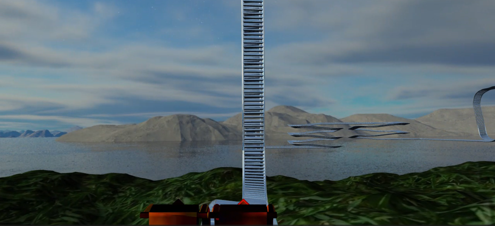

# RollerCoaster Project

## Author
Prad Nanduri

## Course
CMPSC 458

## Description
Fall 2022: Project 2 : RollerCoaster Cubic Splines - Camera

## Overview
This project implements a roller coaster simulation using cubic splines for track generation and camera control. The program allows users to navigate through the roller coaster experience with various camera controls and visual features.

## How to Run
To run the program, open the `Project_2.exe` file.

## Keybinds
- **T**: Toggle the camera to the track (when the camera is on the roller coaster, the W, A, S, D keys and mouse rotation will not work).
- **N**: Toggle the drawing of normals.
- **H**: Toggle the drawing of the heightmap.
- **Q**: Toggle quaternions.

- **W**: Translate the camera forwards.
- **S**: Translate the camera backwards.
- **A**: Translate the camera left.
- **D**: Translate the camera right.

- **Mouse Rotation**: Change the orientation of the camera.

## ScreenShots

- 
- 
- 


## Code Structure
### File Locations and Key Functions
- **Project2.hpp**
  - Line 62: Added the required new variables for the track, velocity, and position for the camera.

- **Project2.cpp**
  - Line 282: Included a different heightmap (source below).
  - Line 282: Removed the drawing of the boxes at every point.
  - Line 375: Toggle the camera to the position on the track determined by the computer time, the force of gravity, and the current velocity. This, along with the current height, is used to find the next position of the camera.
  - Line 436: Draw the normals of the track.
  - Line 514: Added the IO function for the T key to toggle the camera to the track.

- **track.hpp**
  - Line 73: Function `get_camera_orientation`, returns the correct camera orientation for that position of the track.
  - Line 92: Function `height_difference`, returns the difference in height the cart on the track moved to determine the new velocity using physics.
  - Line 96: Function to get the direct distance difference in 3D space (skyboxes).
  - Line 100: Function `velocity`, gets the velocity of the cart.
  - Line 104: Function `distance_moved`, returns the distance the cart must move with the current velocity.
  - Line 108: Returns the whole track length so the camera knows when to restart.
  - Line 114: Draws the track and scales it.
  - Line 155: Gets the 4 points needed to interpolate from the vertex list (ensures the points do not exceed).
  - Line 218: Print function for testing the interpolation function.
  - Line 241: Function `interpolate`, uses Catmull-Rom spline to interpolate 4 points in 3D space.
  - Line 311: Defines an orientation to start with at the beginning of the track, also the same orientation that the cart ends with for a seamless transition. A for loop is used to divide each point into 10 subpoints using the interpolation function and the cross product for the orientation defined in class. The orientations are then sent to make track parts.
  - Line 406: `make_vertex` is the same as `heightmap_make_vertex`, this time including a normal coordinate.
  - Line 426: `make_triangle` takes 3 points and creates the vertices, then pushes them back into the vertices list.
  - Line 466: `make_rectangle` takes 4 points and divides them into two triangles, flipping the normal on one of them.
  - Line 466: `make_rail_plank`, interpolates the function of a circle to create 2 circles on each side of the track, then connects them using `make_rectangle`.
  - Line 493: `make_rail_part`, creates the rails by interpolating polar coordinates of a circle and connecting them.
  - Line 555: `setup_track`, creates the VBO buffer for the vertices and the VAO pointer to the buffer, also defines the vertices attribute pointer for the position, normal, and texture coordinates.

## Submission Contents
```
|   Project_2_Prad_Nanduri.mp4
|   Project_2.md
|   README.md
|
+---Headers
|       camera.hpp
|       heightmap.hpp
|       mesh.hpp
|       model.hpp
|       Project2.hpp
|       rc_spline.h
|       shader.hpp
|       track.hpp
|
+---Media
|   +---cart
|   |       roller.mtl
|   |       roller.obj
|   |       roller.obj.blend
|   |       roller.obj.blend1
|   |       roller.obj1
|   |
|   +---heightmaps
|   |       grass.jpg
|   |       hflab4.jpg
|   |       spiral.jpg
|   |
|   +---skybox
|   |       back.jpg
|   |       back.png
|   |       bottom.jpg
|   |       bottom.png
|   |       front.jpg
|   |       front.png
|   |       left.jpg
|   |       left.png
|   |       right.jpg
|   |       right.png
|   |       top.jpg
|   |       top.png
|   |
|   +---spline
|   |       track-backup.sp
|   |       track.sp
|   |
|   +---spline_parts
|   |       magic.sp
|   |       negx.sp
|   |       negy.sp
|   |       negz.sp
|   |       pointsgenerator.py
|   |       testTrack.sp
|   |       turn-loop.sp
|   |       turn-negx-negy.sp
|   |       turn-negx-negz.sp
|   |       turn-negx-y.sp
|   |       turn-negy-x.sp
|   |       turn-negy-x2.sp
|   |       turn-screw.sp
|   |       turn-screw2.sp
|   |       turn-x-negy.sp
|   |       turn-x-y.sp
|   |       turn-x-y2.sp
|   |       turn-x-z.sp
|   |       turn-x-z2.sp
|   |       turn-y-negx.sp
|   |       x.sp
|   |       y.sp
|   |       z.sp
|   |       zig.sp
|   |
|   \---textures
|           awesomeface.png
|           container.jpg
|           container2.png
|           container2_specular.png
|           fire.jpg
|           wall.jpg
|
+---Shaders
|       lightingShader_basic.frag
|       lightingShader_basic.frag~
|       lightingShader_basic.vert
|       lightingShader_basic.vert~
|       lightingShader_nMap.frag
|       lightingShader_nMap.frag~
|       lightingShader_nMap.vert
|       lightingShader_nMap.vert~
|       lightingShader_specular.frag
|       lightingShader_specular.vert
|       lightingShader_specular.vert~
|       normal.frag
|       normal.frag~
|       normal.geom
|       normal.geom~
|       normal.vert
|       normal.vert~
|       reflectionShader.frag
|       reflectionShader.vert
|       skyboxShader.frag
|       skyboxShader.vert
|
\---Sources
        Project2.cpp
        rc_spline.cpp
```


## Extra Credit
- I have used polar coordinates of a circle to interpolate the rails and make them as round as possible. The resolution of the rails can be changed to make them appear more round by adding more faces (Set to 10 for performance).
- I have added a roller coaster cart model that will ride around the track without the camera.

## Resources
- Skybox: [OpenGameArt - Ulukai's Space Skyboxes](https://opengameart.org/content/ulukais-space-skyboxes)
- Heightmap texture: [Creative Market - Lush Seamless Grass Texture](https://creativemarket.com/hhh316/247499-Lush-Seamless-Grass-Texture#fullscreen)
- Roller coaster cart: [Free3D - Roller Coaster Model](https://free3d.com/3d-model/roller-coaster-9242.html)
- Fire texture: [TextureX - Fire Textures](https://www.texturex.com/fire-textures/fire-texture-hot-flame-red-burn-stock-photo-wallpaper/)
